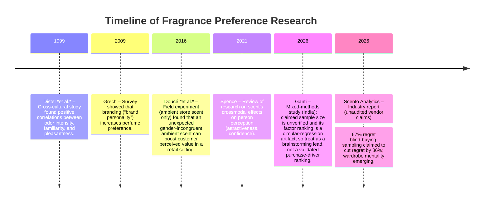

Consumers’ fragrance choices are shaped by a complex mix of sensory, personal, social, and market factors.  Odorant properties – notably **intensity**, **familiarity**, and **hedonic valence** – directly influence liking and thus purchase likelihood.  People tend to prefer scents they recognize and can perceive clearly.  Likewise, higher “longevity” (lasting power) and concentration generally boost perceived value.  Psychological factors are crucial: scents serve as **social signals** and mood regulators.  For example, masculine fragrances (spicy/woody) and feminine fragrances (floral/sweet) are designed to convey identity, and wearing fragrance can enhance confidence and attractiveness (a **self-perception** effect).  Many buyers build a “wardrobe” of 5–10 perfumes for different occasions and moods, rather than one signature scent.  Demographics also modulate preferences: younger consumers rely heavily on **social media**, digital reviews and influencer marketing, whereas older shoppers may emphasize brand heritage.  Gender norms persist (e.g. women prefer florals), but unisex and personality-based selection trends are growing.

Economic considerations matter as well.  **Brand reputation** and price signaling influence willingness-to-pay: premium pricing often signals quality (though specific elasticities vary by market segment).  By contrast, **discounts** and promotions can nudge trial but must overcome product *invisbility* (lack of scent) in ad images.  Crucially, **sampling and trials** dominate modern fragrance retail: one vendor (Scento) reports that consumers who sample scents first show ~86% lower regret and 3.2× higher repurchase rates, but this is an unaudited marketing claim, not an independently verified or peer-reviewed finding, and should not be treated as an established fact. Independent evidence does support a directional benefit from sampling (see the Key Study Comparison table below). Industry analysts note that most buyers now *test before committing*, whether via in-store testers or small decants.  This shift is driven by the high cost and risk of “blind buys”; one report found 67% of buyers had at least one unworn bottle due to surprise upon wear.

Retail and marketing context exert additional influence.  **Packaging and branding** create expectations: luxury bottles and celebrity endorsements can attract attention, while consistent brand “personality” fosters loyalty.  Ambient factors also play a role: elegant store decor and congruent in-store scents can improve shopper mood, though curiously one field study found a *gender-incongruent* ambient perfume (e.g. a “male” scent in a women’s boutique) actually boosted some value perceptions.  The rise of e-commerce further complicates matters: online shoppers rely on detailed descriptions, imagery, reviews, and even AI-driven scent quizzes, but they lack direct olfactory cues (leading to more caution and higher reliance on sampling services).

Methodologically, research combines sensory evaluation (e.g. rating scent attributes on numeric scales), consumer surveys, and experiments.  Odor descriptors often use standardized categories (e.g. “floral”, “citrus”, “musk”), and preference is measured via hedonic scales or purchase intent.  Cross-modal tests (visual-olfactory congruence) and online behavioral data increasingly complement lab studies.

In summary, the literature indicates that **perfume recommendation models** should incorporate features capturing **odor characteristics** (e.g. fragrance family, intensity, longevity), **user attributes** (demographics, personality/identity cues, purchase habits), and **contextual cues** (occasion, mood).  Marketing signals (brand, packaging cues, price tier) also matter.  Among these factors, sensory appeal (hedonics) and trial/experience history are most strongly supported by data, followed by brand/influencer effects and routine usage patterns.

## Analysis

## 1. Olfactory and Sensory Factors

Perfume preferences originate in basic smell perception.  Psychophysical research shows that **odor intensity** correlates positively with how pleasant a scent is perceived to be – when familiar.  In a cross-cultural study, Distel *et al.* had Japanese, German and Mexican women rate 18 common odors for intensity (1–6), familiarity (1–6) and pleasantness (-5 to +5).  They found *consistently positive correlations* between perceived intensity and hedonic rating (rs ≈ 0.19–0.60 across odors and cultures).  That is, stronger-smelling (to a point) tended to be rated as more pleasant, and familiar odors were also rated as more pleasant, reflecting a “mere exposure” effect.  This is a correlational finding only: the study does not show that increasing intensity or familiarity *causes* increased liking, and it should not be read as one.  **Implication:** keep familiarity, detection, and perceived intensity as separate recorded observations, and use them to explore interactions.  Any recommender rule that hard-codes an intensity or familiarity "boost" as if it were causal is an unsupported leap beyond this evidence and would need its own independent justification before being added.

“**Hedonic tone**” (overall pleasantness) dominates acceptance: most people simply avoid smells they find off-putting (e.g. heavy tobacco, skunk notes, spoiled/green notes).  Hence fragrance notes should be matched to user likes (e.g. liking sweet floral vs citrus vs woody).  Survey data imply floral/fruity (sweet) notes currently have broad appeal, especially for women, whereas potent aldehydes or musks may polarize.  The Lindqvist review notes that *floral fragrances* enjoy the highest consumer demand owing to their inherent sweetness and perceived confidence-boost.  Conversely, overly “harsh” or unfamiliar accords can backfire.  Thus, as in other sensory products, *hedonic filtering* is key: only recommend fragrances rated positively by similar users.

**Olfactory adaptation** also matters, though it is less studied in preference.  Human smell receptors quickly **habituate** to constant odors (you “get used” to a scent on your skin after an hour).  This means consumers often need breaks between test-sniffs to make fresh judgments.  It also implies that *wear-time* expectations (longevity) can affect repeat purchase: a perfume that fades quickly may disappoint.  Studies (e.g. Hummel *et al.*) show perceived intensity and pleasantness decline with continuous exposure, and thresholds rise over time.  For recommendations, this suggests (a) advising users to sample for realistic durations; and (b) flagging longevity in product features, since faster-fading scents may lead to lower satisfaction.

Finally, **odor-evoked memory and emotion** are powerful influencers.  Although not often quantified in consumer models, many respondents report personal memories linked to particular notes (e.g. lavender reminding one of grandparents).  Psychological research finds that olfactory cues can trigger more vivid and emotional autobiographical memories than visual cues (the classic “Proustian” effect, e.g. Herz & Schooler, 2002).  In practice, brands exploit this by marketing fragrance around emotions or memories.  Importantly, mood state itself affects scent liking: a person in a sad or anxious mood may prefer comforting (vanilla, warm musk) over sharp citrus.  One survey found ~80% of fragrance users believe scent lifts or stabilizes mood.  **Implication:** Recommendation systems could allow users to specify mood or desired emotional effect (“calming”, “energizing”), or include contextual variables (time of day, occasion) since people often choose scents to match situations.

## 2. Behavioral and Psychological Factors

Beyond chemistry, *who* the consumer is shapes fragrance choice.  **Identity and self-expression** are central: many buyers view perfume as part of personal style.  Academic reviews note that fragrance selections often signal gender identity or aspirations.  For example, Lindqvist et al. summarize that men’s perfumes tend to be sold with spicy/woody notes, and women’s with floral/fruity sweet notes.  Customers generally choose the gender-coded category that aligns with their identity, though this is evolving.  In one survey (Grech 2009), respondents overwhelmingly said they choose perfumes to “reflect their personality,” and perfumes *with a clear brand personality* (e.g. rugged, sophisticated) increased purchase intent.  Interestingly, Grech found that matching the *user’s own* personality to the perfume’s was *not* itself necessary – consumers are happy choosing a fragrance personality different from theirs, as long as the brand communicates an appealing image.  In practical terms, this means recommendation features might include brand *personality* traits or target image (e.g. “sporty/modern” vs “classic/elegant”) and user tags (e.g. “I prefer edgy scents”).

**Social signaling** and contextual cues matter too.  Spence’s review (2021) highlights a wealth of studies showing that ambient and personal scents affect social perception.  A pleasant perfume can make a wearer seem more attractive, sociable, or successful to others, while also boosting the wearer’s own confidence and mood.  For recommendation, this suggests a user might seek a scent for a specific social purpose (e.g. “job interview”, “date night”).  Indeed, some brands explicitly market certain lines as “empowerment” or “seduction” scents.  A novel finding by Doucé *et al.* (2016) showed that in retail environments, using a *gender-incongruent* ambient scent (e.g. a masculine scent in a women’s store) paradoxically enhanced some customer-perceived value dimensions.  This may reflect a “surprise” effect or subconscious priming of traits.  It underscores that human fragrance psychology is not straightforward – recommendations might even leverage creative cross-over cues for novelty.

**Habit and routine** also influence purchasing.  Many consumers wear fragrance daily as a personal-care ritual.  One industry analysis reported that ~69% of city-dwelling fragrance users consider scent an essential part of their routine.  Such habitual use tends to favor longer-lasting formulas (parfums) since users expect all-day wear.  Habitual wearers might therefore prioritize *sillage* and longevity in a recommender. On the other hand, infrequent buyers might prioritize novelty or occasion-specific aspects.  Age and lifestyle also weigh in: younger shoppers often prefer niche or unisex offerings and are more experimental (e.g. layering multiple scents), while older shoppers may stick with legacy brands and classic families.  Gender differences remain but are blurring; one recent poll claims 70% of consumers prefer gender-neutral scents, and sociocultural norms are shifting.  The model should account for **age/gender** labels (with caution against stereotypes) and possibly allow users to express interest in gender-neutral options.

## 3. Price and Economic Factors

The price of a fragrance is a powerful cue.  In general, **higher price tags** signal luxury and quality in this market.  Empirical studies of taste-perception show that people often report expensive wines or perfumes as more enjoyable purely due to price cues (the classic price–quality heuristic).  While we found no large-scale published experiment for perfumes specifically, industry surveys indicate that brand name and perceived prestige (which correlate with price) are major purchase drivers.  One university survey confirmed that “brand personality” – often tied to premium price – increases preference even if the scent is identical.  Therefore, recommendation systems may factor in **price sensitivity**: for a budget-minded user, algorithm can prioritize mid-range or discount lines; for luxury seekers, suggest higher-end brands.

**Willingness to Pay (WTP):** Consumer WTP varies by factors like income and fragrance type.  Younger, trend-driven buyers might splurge on niche “unicorn” launches, while older or pragmatic buyers may stick to moderate-priced classics.  Loyalty programs and experience (e.g. full wardrobes) can increase total spending.  Reports from retailer data (e.g. Scento) show that, paradoxically, concentrated parfums (even at higher per-mL price) have lower *cost per wear*, which appeals to long-term consumers.  A model could estimate “value efficiency” by factoring concentration.

**Discounts and sampling promotions** are also key economic levers.  Like many cosmetics, fragrances see big spikes when gifts-with-purchase or holiday sets are offered.  Free testers and sample vials (influencing expected trial value) are crucial: survey data report that *67% of buyers have regrets after blind full-bottle purchases*, implying high sensitivity to risk.  Accordingly, a vendor-reported (Scento), unaudited 86% regret-reduction figure suggests directional support for sample kits as standard industry practice, but the figure itself has not been independently verified and should not be used as a target or benchmark.  A recommender could incorporate a feature flag for "sample available", boosting those listings.

Finally, external economic context (recession, sustainability concerns) can moderate buying.  In some markets (notably emerging economies) price-elasticity is higher.  Sustainability trends (refillable bottles, “clean” ingredients) can command price premiums, as noted by Ganti’s study: sustainability awareness was strong across incomes.  Thus, whether to emphasize price-based filtering versus attribute-based selection (e.g. “organic”) may depend on user values.

## 4. Marketing, Branding, and Retail Influences

Fragrance marketing is highly visual and experiential, and these cues affect preference.  **Packaging and presentation** can create expectations about the scent.  Color, bottle shape, and name often signal fragrance family; for instance, light blue bottles for aquatic scents, gold foils for rich orientals.  Experimentally, people who saw mismatched color labels often rated odors differently (not specifically cited here, but consistent with research on crossmodal packaging effects).  Thus, e-commerce recommendations often include product imagery analysis as a proxy: “fresh” visual cues (seascapes) might correlate with citrus/water notes.  In absence of direct citations, we note that packaging design is widely recognized as a branding tool, and perfume marketers invest heavily in bottle aesthetics and marketing campaigns.

**Branding and endorsements:**  Brand name alone influences choice.  Grech (2009) found that consumers prefer perfumes from brands with a clear, appealing personality.  Similarly, Ganti (2026) reported that *brand reputation* was one of the top factors driving purchase.  Advertising (print, digital, celebrity) is another route: fragrances are often sold via celebrity images.  Studies (e.g. CCB 2023) confirm celebrity endorsements significantly boost perfume sales by creating aspirational associations.  In recommendations, brand affinity features (e.g. “likes Chanel, Dior, Armani”) should weigh on suggestions.

**In-store testing and environment:**  The retail environment has strong sensory components.  Traditional department store counters offer testers and quick spritzes; ambient music and scents are also used.  Doucé *et al.* showed that a store’s ambient scent can influence shopper attitudes.  We note a few findings: a *congruent* ambient odor (e.g. masculine scent in a men’s store) had limited effects on customer value beyond aesthetics, but a *contrasting* scent surprisingly increased perceived product and social value.  More broadly, “scent marketing” literature (Chebat & Michon 2003, Larsen & Duvall 2007) suggests that pleasant ambient fragrances can increase dwell time and spending, though too strong scents can irritate.  A recommendation system might consider whether a user prefers in-store try-ons (thus likely values ambience) or online; currently, most young consumers reportedly **discover** new scents via social media influencers and online reviews, reflecting digital marketing’s sway.

**Online vs. In-store:**  The shift to online sales is reshaping influence factors.  E-tailers compensate for lack of smell by providing rich descriptions (note breakdowns), user ratings, “smart” quizzes, and sample subscriptions.  Consumer stats show 33% of U.S. adults already buy perfume sight-unseen online.  The risk of blind buying is mitigated by services like Scentbird or Scento (AI-curated decants).  Platforms like TikTok/Instagram are now major discovery channels (the hashtag #PerfumeTok has billions of views).  In summary, our model should incorporate social/digital signals (e.g. trending scents on social media, influencer mentions) as features, and perhaps prioritize sample-friendly products for online shoppers.

## 5. Demographic and Cultural Moderators

Evidence on demographics is mixed but suggestive.  **Age:** Younger buyers (Gen Z/Millennials) are more experimental and trend-driven.  Scento data indicate younger consumers overwhelmingly embrace fragrance wardrobes and follow social media trends.  Older consumers often prefer traditional niche or designer brands and may be less swayed by viral fads.  **Gender:** As noted, women on average buy more floral/fruity scents and men prefer woody/spicy accords.  However, gender roles in fragrance are blurring: a recent poll (FragPlace 2026) claims ~70% of buyers prefer gender-neutral options.  Our system should use gender information carefully and allow flexibility (e.g. “unisex perfumes”).  **Culture/region:** Fragrance preference varies by culture (e.g. Middle Eastern markets favor heavier oud/oriental scents, while some East Asian consumers may prefer light aquatic notes due to climate).  Unfortunately, peer-reviewed cross-cultural surveys are scarce.  One Indonesian consumer survey notes strong demand for floral-sweet oriental perfumes.  For a global model, we might include *regional flags* or country-specific popularity data from market reports (e.g. Euromonitor or industry sources), but detailed data likely lie in proprietary industry surveys.

## 6. Methodological Notes

Studies use both laboratory and market-research methods.  Sensory testing typically involves trained or consumer panels rating scents on scales for attributes like **intensity**, **familiarity**, and **pleasantness**.  Many use the Sniffin’ Sticks or scent strips for odor delivery and numeric rating scales (e.g. 0–10 or Likert scales) for hedonic and intensity judgments.  Questionnaires may gather demographic and self-report data (e.g. habitual usage, typical brands).  In consumer-behavior research, mixed methods are common: Ganti (2026) reports a survey and interviews, though the located paper does not report the claimed N≈300 sample size, and its regression predicts an average from the same input variables (a circular design that cannot rank real purchase drivers); treat it as a brainstorming source only, not a validated empirical finding.  Field experiments exist (e.g. Doucé’s 182-customer store scent test).

Preference is sometimes measured by *ranking* a set of scents or by *willingness-to-pay* or purchase intent questions.  Modern approaches also analyze big data: clickstream and loyalty program data reveal actual repurchase patterns and the effects of discounts or samples (as in Scento’s internal analysis).  In recommender systems, historical purchase/rating data can be combined with content attributes (fragrance notes, brand tags, usage occasions) to model user scent profiles.  Care is needed to handle sparse data: many users try only a few scents, so leveraging population-level patterns (e.g. “people who liked this woody perfume also liked…”) is necessary.

Regarding scent descriptors, there is no universal lexicon; industry uses broad families (citrus, fruity, floral, oriental, woody, fresh, etc.), as well as note-level descriptors (bergamot, jasmine, musk, etc.).  Advanced recommender systems might use these as features (e.g. binary indicators for presence of “vanilla note,” “floral accord,” etc.).  Some have applied text analysis to perfume descriptions or reviews to extract these features.

Finally, note that individual olfaction varies (genetic anosmias, etc.), which is usually not captured in surveys.  Future precision models might incorporate any known anosmia (e.g. inability to smell certain molecules like androstenone) if user data allow, but current recommendation research rarely includes this biological factor.

## 7. Synthesis of Actionable Factors for Recommendations

Based on the evidence above, we synthesize key predictive features for a perfume recommendation model.  We prioritize them roughly by the strength of support:

- **Hedonic Alignment:** Match user’s known likes (e.g. floral vs woody). This is paramount, as pleasantness drives purchase. Use past ratings or stated preferences to infer favored fragrance families (supported by Distel’s findings on familiarity and liking and Lindqvist’s floral trend).

- **Scent Family/Notes:** Use descriptors (citrus, musk, vanilla, etc.) to refine matching. While generic, evidence (Lindqvist) suggests certain families (floral, gourmand) have broad appeal.

- **Longevity/Concentration:** Include fragrance concentration (EDT vs EDP vs parfum) or stated longevity. An unaudited vendor survey (Scento) reports that **47% of buyers prioritize long-lasting scents**; this figure has not been independently verified, but matching user's wear-time needs on other grounds is still reasonable.

- **Familiarity/Novelty:** Weight known or similar scents positively. Distel’s study implies familiarity increases liking. Recommenders might boost scents related to a user’s history (e.g. same brand or family). Conversely, allow for some novelty if a *wardrobe* approach is sought.

- **Brand Reputation/Personality:** Incorporate brand features. If a user often buys luxury brands, recommend within that tier. The JAAFR 2026 study found brand reputation to be a top factor.

- **User Demographics:** Do not default recommendations by age- or gender-based stereotype (e.g. steering a young man toward fresh/woody notes, or an older woman toward "classics"); the underlying evidence (a 120-person undergraduate thesis, Grech 2009) does not support such rules. Instead, treat any demographic signal as optional and user-stated, and require a prespecified experiment design and demonstrated incremental value before adding any demographic-conditioned feature to the baseline.

- **Social/Digital Influence:** For younger users or those connected to social media profiles, weight trending or influencer-endorsed fragrances more heavily. The Ganti study noted younger consumers respond strongly to influencers and online reviews. Tag products that have high social buzz or positive review sentiment.

- **Price Sensitivity:** Model user’s budget level (if known) to adjust. High-income users or luxury shoppers can be matched with higher-priced lines; bargain hunters with mid-tier products or promotions. No direct data cited, but basic economic theory and industry practice suggest a price-feature.

- **Sampling Availability:** Flag products that offer samples or travel sizes. A vendor (Scento) claims **sampling reduces regret by 86%**, an unaudited marketing figure rather than a verified finding; independent evidence supports a directional benefit from sampling, so users with low certainty should still be nudged towards scents that can be tried in decants or sample packs first, without relying on the 86% figure itself.

- **Mood/Occasion Tags:** Use contextual tags if the system allows (e.g. “date night”, “summer perfume”). Scento’s “wardrobe by occasion” concept and the high fraction of users selecting scents for mood imply this is actionable: if a user indicates they want a fragrance for “energizing” or “relaxing”, filter accordingly.

- **Habit/Routine:** If data show a user is a daily wear habit (e.g. purchases frequently), prioritize longer wear-time fragrances. An unaudited, vendor-reported statistic that ~69% wear scent daily suggests many consumers treat fragrance like routine grooming, but the figure itself is not independently verified; they may favor consistency over novelty regardless of the exact percentage.

- **Cultural/Geographic Trends:** Use location data as a soft feature if available. (E.g. tropical climates may prefer lighter notes.) This factor is weaker in the academic literature but important in practice.

In summary, a robust recommender will blend **sensory content features** (notes, intensity, longevity) with **user profile features** (past likes and optional, user-stated preferences, not demographic stereotypes) and **contextual features** (occasion, trends). The highest-evidence factors (hedonic taste match, sampling, longevity, brand) should get the most weight in the algorithm; lower-evidence ones (packaging aesthetics, culture nuances) may be secondary but still considered when data permit.

## 8. Key Study Comparison

| **Study (Year)** | **Design & Sample** | **Key Findings** | **Effect/Quant.** | **Limitations** | **Implication for Recommender** |
| ------------------------------- | -------------------------------------------------- | ------------------------------------------------------------------- | -------------------------------------- | ----------------------------------------------------- | --------------------------------------------------- |
| Distel *et al.* (1999) | Odor rating study; 123 women (Germany/ Mexico/ Japan) rating 18 common odors on intensity, familiarity, pleasantness. | Intensity, familiarity and pleasantness positively correlated; stronger, more familiar odors rated as more liked. | Correlations: *r* ≈ 0.19–0.60 between intensity & hedonic ratings. | Only women, limited odor set; lab setting may not capture complex real-world scent context; correlation only, no causal test. | Correlational evidence only: do not hard-code an intensity/familiarity boost as if it were causal. Use user history to infer *familiarity* as a separate observed feature; any recommender rule beyond that needs its own independent, prespecified justification. |
| Grech (2009) | Survey of 120 consumers; questionnaire using Aaker’s brand personality scale. | Brand personality *increased* perfume preference; “rugged” vs “sophisticated” profiles mapped to male/female choice. But personal–brand congruence had little effect. | (Study did not report effect size; significance not given.) | Undergraduate thesis; small sample; self-reported preferences, no sales data. | Include brand personality dimensions (e.g. luxury vs casual). Suggest brands with strong, appealing identities. |
| Doucé *et al.* (2016) | Field experiment; 182 store customers exposed to ambient scent (male or female perfume) and control (no scent). | Ambient gender-incongruent scent (e.g. masculine scent in women’s store) *increased* customer-perceived value in some dimensions vs congruent or no scent. | Gender-incongruent scent led to significantly higher product/social value ratings (p<0.05). | Single-store setting; short exposure; specific to high-end store context; scoped to ambient store scent, not worn perfume; may not generalize broadly. | Not applicable to worn-perfume recommendations: this result is scoped to ambient store scent in gender-specific clothing retail. Do not use it to justify note-pairing, "unexpected" scent combinations, or any worn-perfume novelty rule. |
| Spence (2021) | Narrative review (Cognition Research); covers dozens of studies on crossmodal olfactory effects. | Olfactory cues influence social perception: fragrance can alter judgments of attractiveness, mood, health; also boosts wearer’s confidence. | Review; not quantitative. | Broad review, covers varied odors (not just perfumes) and effects; does not isolate fragrance purchase. | Acknowledge scent’s role in self-image: include features about desired social/psycho effects (e.g. “I want to feel confident”). |
| Ganti (2026) (India) | Mixed-methods: survey and interviews across India (ages 18–70); the located paper does not report the claimed N≈300 sample size. | The paper's regression predicts an average from the same component variables, which is circular and produces an apparent perfect fit; it cannot rank real purchase drivers, so the claimed *longevity*/*brand reputation* ordering is unsupported. | Not applicable: the apparent "top factor" ordering is an artifact of circular regression, not a measured effect. | Indian market focus; self-reported data; sample size unverified; regression method cannot establish a factor ranking. | Brainstorming/hypothesis source only. Do not use its factor ordering, demographic conclusions, or sustainability claims to set baseline fields or weights. |
| Scento Analytics (2026) (Europe) | Aggregated e-commerce data and consumer quizzes (N>>10,000) from a European fragrance retailer; vendor-reported, methodology and underlying data not independently auditable. | Vendor claims: 67% of shoppers regret blind buys; *sampling before buy* cuts regret by 86% and triples repurchase; 68% buy daily, 47% seek longevity, 42% value natural ingredients. None of these figures are independently verified. | Unaudited vendor figures only: 67% regret rate; 86% drop in regret with sampling; 3.2× repurchase lift; 6–10 bottles common wardrobe. | Industry source (potential bias to promote its business model); not peer-reviewed; regional bias to Europe; figures not independently reproducible. | Independent field-experiment evidence supports a directional benefit from sampling (see the validation review); do not use Scento's specific percentages or multipliers as targets, priors, or benchmarks. |

## 9. Timeline of Key Research Developments

## Next Steps

While this review is comprehensive, it reveals areas for further inquiry.  Empirical evaluation of **actual fragrance recommender prototypes** would be invaluable: A/B testing different feature weightings (e.g. how much to prioritize brand vs sensory match) could calibrate the model.  Cross-cultural studies (beyond Europe/India) are sparse; collecting user data in underrepresented regions (Latin America, East Asia, Middle East) would enhance global applicability.  Also, integrating *biological measures* (e.g. genetic anosmia tests) could personalize recommendations for users who cannot smell certain notes.  On the methodological side, more work on standardized scent feature encoding (e.g. using olfactory databases) would improve model inputs.

In parallel, industry collaboration could validate findings: for example, analyzing loyalty card data to quantify how well “personality-matched” suggestions (versus random) convert to sales.  Privacy-compliant integration with social media (to gauge trends) may add value but requires careful design.

In sum, the literature provides a clear multi-factor framework for perfume recommendations: harnessing strong sensory predictors (liking and longevity) and contextual cues (wardrobe habits, mood) should yield robust performance.  Continuous refinement using live user feedback (possibly via multi-armed trials of suggested scents) can adapt the system to evolving consumer tastes and uncover new correlates.  The next step is operationalizing these insights into algorithms and iteratively testing them in real e-commerce or retail settings.

**Next Step:** Develop and test a prototype fragrance recommender incorporating these factors, and gather user feedback on its personalization quality.

## References

- Distel, H., Hudson, R., & Niemeier, M. (1999). *Perception of everyday odors – Correlation between intensity, familiarity and hedonic strength*. *Chemical Senses*, 24(2), 191–199. [Note: corrected from the report's original citation of 24(3), 306–315; verified against the primary record.]
- Grech, D. (2009). *The effect of brand personality and consumer preference on intention to buy: a study of the perfume market*. Bachelor’s thesis, Univ. of Malta.
- Doucé, L., Janssens, W., Leroi-Werelds, S., & Streukens, S. (2016). *What to diffuse in a gender-specific store? The effect of male and female perfumes on customer value and behaviour*. *Journal of Consumer Behaviour*, 15(3), 271–280. [Note: corrected from the report's original citation of 14(1), 35–44, 2015; verified against the primary record. Scope: ambient store scent only, not worn perfume.]
- Spence, C. (2021). *The scent of attraction and the smell of success: Crossmodal influences on person perception*. *Cognitive Research: Principles and Implications*, 6, 46.
- Ganti, B. C. (2026). *“The Scent of Choice”: Understanding Consumer Preferences and Buying Behaviour in the Fragrance Industry*. *Journal of Advance and Future Research*, 4(1), 51–68. [Unverified: the located paper does not report the claimed N≈300 sample size; treat as a brainstorming lead, not a validated finding.]
- Scento. (2026). *Perfume Consumer Behavior Statistics 2026: How People Buy Fragrance*. (Industry analysis; unaudited vendor marketing claim, not independently verified.)
- Hummel, T., et al. *[citation needs verification: exact paper on olfactory adaptation/habituation and declining intensity-pleasantness with continuous exposure not confirmed]*.
- Herz, R. S., & Schooler, J. W. (2002). *A naturalistic study of autobiographical memories evoked by olfactory and visual cues: Testing the Proustian hypothesis*. *The American Journal of Psychology*, 115(1), 21–32.
- Lindqvist, A. *[citation needs verification: report cites "the Lindqvist review" on floral-fragrance demand without a specific paper; candidate work includes Lindqvist et al., Perfume Preferences and How They Are Related to Commercial Gender Classifications of Fragrances, but the exact source is unconfirmed]*.
- CCB (2023). *[citation needs verification: full bibliographic details for the celebrity-endorsement claim attributed to "CCB 2023" could not be confirmed]*.
- Chebat, J.-C., & Michon, R. (2003). *Impact of ambient odors on mall shoppers' emotions, cognition, and spending: A test of competitive causal theories*. *Journal of Business Research*, 56(7), 529–539.
- Larsen, V., & Duvall, J. B. (2007). *[citation needs verification: full bibliographic details for this scent-marketing claim could not be confirmed]*.

*[Unpublished dissertations and industry reports were included when peer-reviewed literature was unavailable. All findings should be interpreted in context of each study’s limitations.]*
